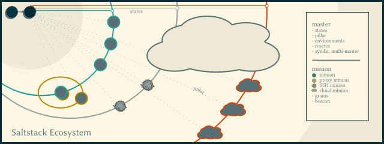

# Gut gesalzen

Neben den Platzhirschen des Config Managements gibt es mit Saltstack eine beachtenswerte Variante, um Befehle auf entfernten Systemen auszuführen (Remote Execution), Abweichungen von definierten Zielzuständen zu beheben, Instanzen bei rund zwei Dutzend Cloud-Anbietern oder auf einem Hypervisor zu verwalten (beispielsweise bei Azure, Amazon EC2, Proxmox oder VMWare) oder diese Infrastruktur-Informationen in Quellcodeverwaltung zu hinterlegen. Dieser Vortrag soll die Arbeit mit Saltstack vorstellen.

 

Der Vortrag richtet sich an Linux-Anwender mit Superuser-Rechten auf zumindest mehr als einem System mit einer LInux-Distribution und soll zeigen, wie man sowohl einige private Laptops als auch ein ganzes Datenanalysecluster administrieren kann. Auch ein Windows-Client kann vom zentralen Salt "Master" verwaltet werden.

Dazu werden zuerste einige Begriffe von Saltstack vorgestellt, und dann aber auf der Kommandozeile die praktische Arbeit demonstriert.

Ziel ist, dass ein Teilnehmer sich nach einer Erstinstallation von Saltstack sicher durch die Funktionalitaeten bewegen kann, um
- sein Benutzerkonto zu verwalten,
- den bevorzugten Editor zu instalierenund
- einige fuer ihn individuell wichtige Programme zu instaliieren.
Damit eignet sich Saltstack hervorragend dafuer, ein frisch installiertes System in den bevorzugten Zustand zu setzen -- und auch darin zu halten.

Besonders elegant geloest ist die Einbindung von Informationen aus Git und Co.: Wer als Teilnehmer den Vortrag zuhause nachvollziehen moechte, kann dies auf einem dezidierten Rechner (bsw dem Raspberry Pi) mit einem Einzeiler tun.

Wenn genuegend Zeit bleibt, werden auch fortgeschrittenere Funktionalitaeten demonstriert:
- bei einem Anbieter von Cloud-Instanzen ein System generiert und gestartet ("salt-cloud")
- die Firmware-Version eines ESP8266 mit MicroPython ausgelesen ("proxy-minion")

Alle Folien, Codeschnippsel und Visualisierungen sind auf GitHub unter https://github.com/helotism/saltstack-intro verfuegbar.
